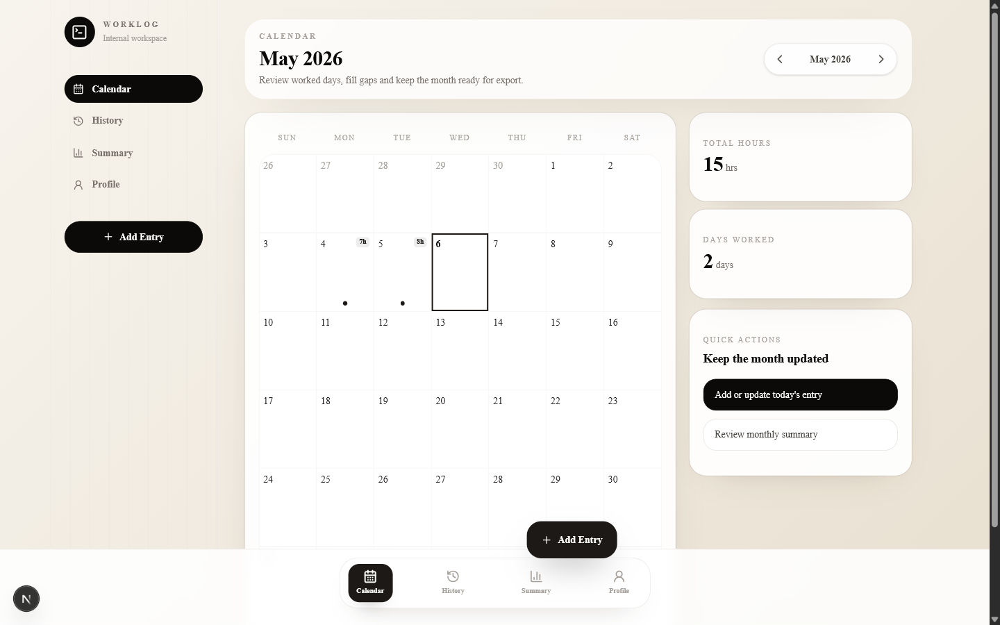

# Work-Tracking Calendar

A focused worklog calendar for tracking worked days, hours, locations, notes, and monthly summaries.

[Live demo](https://work-tracking-calendar-web.vercel.app) | [Repository](https://github.com/devricardo90/Work-Tracking-Calendar)



## Overview

Work-Tracking Calendar helps workers keep a clear record of daily work activity without spreading the workflow across calendars, notes, and spreadsheets. The app centers the month view, lets users record daily entries, and keeps history, totals, locations, and notes in one private workspace.

The current version is deployed and validated as a portfolio/demo-stage product. It is built for practical worklog tracking, not payroll processing or legal timekeeping compliance.

## Core Features

- Email/password authentication
- Calendar-based work tracking
- Add and edit work entries
- Day details view
- Worked, Day Off, and No Work statuses
- Location and notes per entry
- Monthly summary
- History and profile pages
- Responsive app shell with bottom navigation

## Tech Stack

- Next.js 16
- React 19
- TypeScript
- Tailwind CSS
- Better Auth
- Fastify
- Prisma 7
- PostgreSQL
- pnpm workspace
- Vercel for the web app
- Render-compatible API deployment

## Architecture

```text
apps/
  web/   Next.js App Router frontend
  api/   Fastify API, Better Auth, Prisma, and API docs
docs/    Product notes, deployment notes, and design references
```

The web app talks to the API through the configured API base URL. The API owns authentication, user sessions, profiles, saved locations, and work entries. PostgreSQL stores the application data through Prisma.

## Current Status

The deployed app has validated flows for authentication, calendar tracking, entry details, add/edit entry, monthly summary, history, and profile pages. Recent validation also confirmed that lint, typecheck, and web build passed during the UI polish sequence.

Validated flows include:

- Login page loads
- Authenticated calendar loads
- Entry details page opens
- Add/edit entry flow works
- Month navigation works
- Summary, history, and profile routes load
- Responsive desktop and mobile layouts remain usable

## Local Development

### Requirements

- Node.js
- pnpm 10
- Docker Desktop, for local PostgreSQL

### Install Dependencies

```powershell
pnpm install
```

### Configure Environment Files

```powershell
Copy-Item apps\api\.env.example apps\api\.env
Copy-Item apps\web\.env.example apps\web\.env.local
```

Do not commit real `.env` files or production secrets.

### Start Local PostgreSQL

```powershell
docker compose up -d
```

The included compose file starts PostgreSQL on local port `5499`.

### Prepare Prisma Locally

From `apps/api`:

```powershell
pnpm exec prisma generate
pnpm exec prisma migrate dev
```

### Run the API

From the repository root:

```powershell
pnpm --filter api dev
```

Local API health check:

```text
http://localhost:3333/health
```

### Run the Web App

From the repository root:

```powershell
pnpm --filter web dev
```

Local web URL:

```text
http://localhost:3000
```

## Useful Commands

```powershell
pnpm --filter web lint
pnpm --filter web exec tsc --noEmit --pretty false
pnpm --filter web build
pnpm --filter api build
pnpm --filter api typecheck
pnpm test
```

## Limitations

- Portfolio/demo-stage product
- Not a payroll system
- Not a legal timekeeping or compliance tool
- Google sign-in and email delivery depend on provider configuration
- Performance polish may continue later

## Author

Ricardo Souza | [devricardo90](https://github.com/devricardo90)
